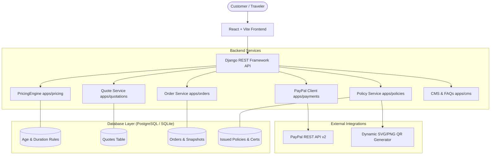
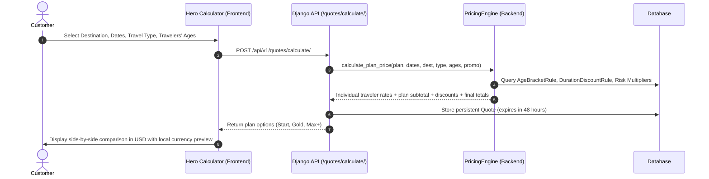
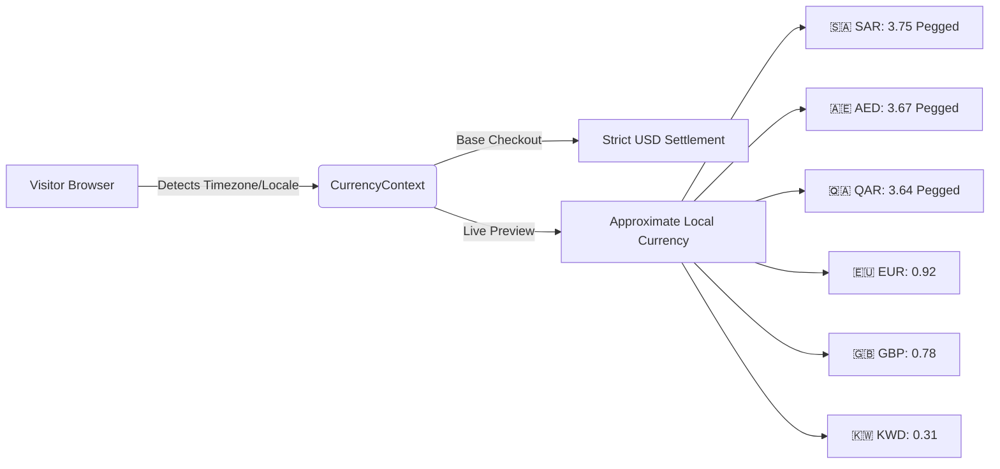
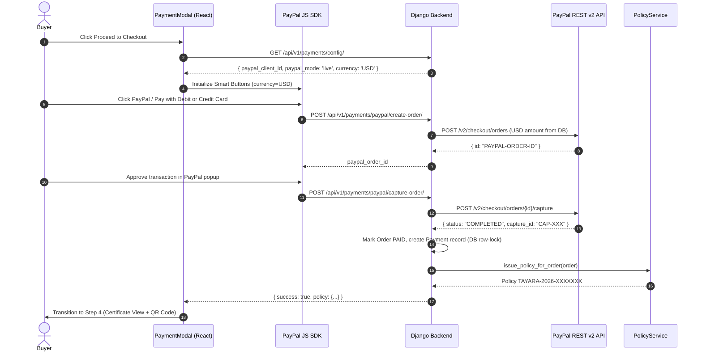

# Tayara Travel Insurance Platform

> **Modern, embassy-compliant digital travel insurance platform built with Django REST Framework and React (Vite). Features standard USD ($) settlement, real-time local currency preview (SAR, AED, EUR, GBP, QAR, KWD), algorithmic multi-factor pricing engine, official PayPal REST API v2 integration, and instant electronic policy issuance with scannable QR verification.**

---

## Table of Contents
1. [System Architecture Overview](#system-architecture-overview)
2. [How Quotations Work (Lifecycle & Flow)](#how-quotations-work-lifecycle--flow)
3. [Deep Dive: Algorithmic Pricing Engine](#deep-dive-algorithmic-pricing-engine)
   - [The Complete Pricing Formula](#the-complete-pricing-formula)
   - [Age Bracket Multipliers (Child vs Adult vs Senior)](#1-age-bracket-multipliers-agebracketrule)
   - [Trip Duration Discount Curves](#2-duration-discount-curves-durationdiscountrule)
   - [Destination Risk Multipliers](#3-destination-risk-multipliers-countryrisk_multiplier)
   - [Travel Activity Multipliers](#4-travel-activity-risk-traveltyperisk_multiplier)
   - [Optional Add-on Coverages](#5-optional-add-on-coverages)
   - [Promotional Discounts](#6-promotional-discounts-promotion)
   - [Concrete Numerical Calculation Examples](#concrete-numerical-calculation-examples)
4. [Currency Architecture (USD Settlement & Local Preview)](#currency-architecture)
5. [Consular & Embassy Compliance (Schengen Regulation EC No 810/2009)](#consular--embassy-compliance)
6. [Payment & Policy Issuance Pipeline](#payment--policy-issuance-pipeline)
7. [Repository Structure & Main Components](#repository-structure--main-components)
8. [Installation & Local Setup](#installation--local-setup)
9. [Deployment & Production Runbook](#deployment--production-runbook)

---

## System Architecture Overview



The platform is split cleanly into two layers:
- **Backend**: Python 3.12 + Django 5.x REST framework. Provides modular apps for authentication, catalog, destinations, pricing algorithms, quotation generation, orders, payments, policy certificate generation, reviews, and CMS.
- **Frontend**: React 18 + Vite + Tailwind CSS + Framer Motion. Single-Page Application (SPA) driven by a 4-step wizard context state machine, full responsiveness, accessible modal drawers, and print-ready CSS stylesheets for official consular certificates.

---

## How Quotations Work (Lifecycle & Flow)

The quotation pipeline allows travelers to obtain binding, personalized insurance quotes within seconds without requiring registration:



### 1. Request Payload
When the user submits the Hero Calculator form, the frontend posts:
```json
{
  "destination_id": "9b1deb4d-3b7d-4bad-9bdd-2b0d7b3dcb6d",
  "start_date": "2026-10-01",
  "end_date": "2026-10-15",
  "travel_type_id": "7c60920c-9c77-4808-af86-af7ff3ef0212",
  "travelers_ages": [35, 8],
  "promo_code": "TAYARA10"
}
```

### 2. Processing & Quote Storage
- The backend validates the inputs (ensuring end date $\ge$ start date, ages between 0 and 100).
- Calculates the trip duration in calendar days: $\max(1, (\text{end\_date} - \text{start\_date}).\text{days} + 1)$.
- For each active insurance plan in the database (`START`, `GOLD`, `MAX_PLUS`), the `PricingEngine` calculates individual passenger daily rates, duration discounts, and promotional deductions.
- An immutable `Quote` model instance is created in the database:
  - Generates a unique quote reference: `QTE-2026-XXXXXXX`.
  - Sets an expiration timestamp (`expires_at` = 48 hours from calculation).
  - Serializes a complete JSON breakdown of every math factor applied (`breakdown_data`).
- Returns all calculated plan options to the client for side-by-side comparison.

### 3. Quote Persistence & Resumption
Travelers can save their quote, sign in later, and resume directly from their **User Dashboard** without having to re-enter traveler ages, dates, or destinations.

---

## Deep Dive: Algorithmic Pricing Engine

The platform implements an actuarial multi-factor pricing engine (`backend/apps/pricing/services.py`).

### The Complete Pricing Formula

$$\text{DailyRate}_i = \text{BasePricePerDay} \times \text{DestinationMultiplier} \times \text{TravelTypeMultiplier} \times \text{AgeMultiplier}(A_i)$$

$$\text{TravelerTotal}_i = \text{round}\Big(\text{DailyRate}_i \times \text{Days}, 2\Big)$$

$$\text{TravelersSubtotal} = \sum_{i=1}^{N} \text{TravelerTotal}_i$$

$$\text{AddonsTotal} = \sum_{k} \Big(\text{AddonDailyPrice}_k \times \text{Days} \times N\Big)$$

$$\text{Subtotal} = \text{TravelersSubtotal} + \text{AddonsTotal}$$

$$\text{DurationDiscountAmount} = \text{round}\Big(\text{Subtotal} \times \frac{\text{DurationDiscountPct}}{100}, 2\Big)$$

$$\text{DiscountedSubtotal} = \max\Big(0.00, \text{Subtotal} - \text{DurationDiscountAmount}\Big)$$

$$\text{PromoDiscountAmount} = \text{CalculatePromo}\Big(\text{DiscountedSubtotal}\Big)$$

$$\text{FinalTotal} = \max\Big(1.00, \text{Subtotal} - \text{DurationDiscountAmount} - \text{PromoDiscountAmount}\Big)$$

---

### 1. Age Bracket Multipliers (`AgeBracketRule`)

Age is one of the most critical risk drivers in travel health insurance. The engine queries active `AgeBracketRule` records:

| Age Bracket Name | Age Range | Multiplier | Effect on Price | Actuarial Rationale |
| :--- | :---: | :---: | :---: | :--- |
| **Infants & Children** | **0 – 17 yrs** | **`0.85`** | **15% Discount** | Lower hospital room rate; pediatric emergency claims are statistically less frequent than senior acute conditions. |
| **Adults** | **18 – 64 yrs** | **`1.00`** | **Standard Baseline** | Standard actuarial baseline for international travel. |
| **Seniors** | **65 – 74 yrs** | **`1.50`** | **50% Surcharge** | Higher incidence of sudden acute illness, cardiovascular vulnerability, and complex repatriation logistics. |
| **Elderly** | **75 – 100 yrs** | **`2.20`** | **120% Surcharge** | Highest actuarial claims risk, potential chronic instability abroad, emergency hospital ICU probability. |

> [!TIP]
> **Child Age Effect**:
> When a family travels with a child (e.g. age 8), the system calculates the child's daily premium at **15% less** than the adult rate. For example, on a $2.50/day baseline, the adult pays $2.50/day while the child pays only $2.13/day.

---

### 2. Duration Discount Curves (`DurationDiscountRule`)

To incentivize longer stays and seasonal travelers, volume discounts are automatically applied to the subtotal:

| Stay Category | Duration Range | Volume Discount | Typical Traveler Profile |
| :--- | :---: | :---: | :--- |
| **Short Stay** | **1 – 14 days** | **`0%`** | Standard 1 to 2-week vacations or business trips. |
| **Medium Stay** | **15 – 29 days** | **`5%`** | Extended family visits and multi-city vacations. |
| **Long Stay** | **30 – 89 days** | **`10%`** | 1 to 3-month tourist visa holders. |
| **Seasonal / Nomad** | **90+ days** | **`20%`** | Digital nomads, wintering tourists, university exchange students. |

---

### 3. Destination Risk Multipliers (`Country.risk_multiplier`)

Health care costs vary by region:

| Destination / Country | Risk Multiplier | Medical Cost Context |
| :--- | :---: | :--- |
| **Schengen Core** (France, Germany, Italy, Spain, Poland, Greece) | **`1.00`** | Standard European regulated medical tariffs. |
| **Turkey** | **`1.05`** | Moderate tourist medical inflation. |
| **Switzerland** | **`1.10`** | Premium alpine rescue and private hospital rates. |
| **United Kingdom** | **`1.15`** | Non-NHS private international emergency clinic rates. |
| **Worldwide / USA** | **`1.25`** | High-cost private hospital treatment and air ambulance repatriation. |

---

### 4. Travel Activity Risk (`TravelType.risk_multiplier`)

Travelers select their trip purpose, scaling the daily rate based on hazard exposure:

| Travel Purpose | Code | Multiplier | Coverage Scope |
| :--- | :---: | :---: | :--- |
| **Visit / Tourist Visa** | `VISIT_VISA` | **`1.00`** | **100% Embassy & Consulate Approved**. Full coverage for Schengen, UK, US, Gulf visitor visas. Zero deductible. |
| **Calm / Leisure** | `CALM` | **`1.00`** | Sightseeing, beach relaxation, museums, shopping, business conferences. |
| **Active / Sports** | `ACTIVE` | **`1.50`** | Amateur fitness, cycling, gym, swimming, surfing, marked-piste recreational skiing. |
| **Extreme / High Risk** | `EXTREME` | **`2.50`** | Mountaineering, off-piste skiing, scuba diving, skydiving, paragliding, motorsports. |

---

### 5. Optional Add-on Coverages

Certain plan tiers offer optional daily riders:
- **Lost & Delayed Baggage Protection**: +$0.60 / day / traveler (Reimbursement up to $1,000 for airline baggage loss).
- **Sports & Adventure Cover** (on Start tier): +$0.90 / day / traveler.

$$\text{AddonCost} = \text{DailyRate} \times \text{Days} \times \text{TravelerCount}$$

---

### 6. Promotional Discounts (`Promotion`)

The engine checks code validity, activation dates, expiration, and minimum order threshold:
- **Percentage**: e.g., `TAYARA10` deducts 10% from the discounted subtotal.
- **Fixed Amount**: e.g., `WELCOME5` deducts $5.00 USD.
- **Order Floor**: `final_total` is capped at a minimum of **$1.00 USD** to prevent zero or negative charges.

---

### Concrete Numerical Calculation Examples

#### Scenario A: Family Vacation with a Child
- **Plan**: `GOLD` ($2.50/day base price)
- **Destination**: France (Schengen, `risk_multiplier = 1.00`)
- **Activity**: `VISIT_VISA` (`risk_multiplier = 1.00`)
- **Dates**: 10 Days
- **Travelers**:
  1. Traveler 1: Father (Age 36) $\rightarrow$ Adult (`multiplier = 1.00`)
  2. Traveler 2: Mother (Age 34) $\rightarrow$ Adult (`multiplier = 1.00`)
  3. Traveler 3: Daughter (Age 8) $\rightarrow$ **Child (`multiplier = 0.85`)**

**Step-by-Step Math**:
1. **Father**:
   $$\text{DailyRate} = \$2.50 \times 1.00 \times 1.00 \times 1.00 = \$2.50$$
   $$\text{Total} = \$2.50 \times 10 = \$25.00$$
2. **Mother**:
   $$\text{DailyRate} = \$2.50 \times 1.00 \times 1.00 \times 1.00 = \$2.50$$
   $$\text{Total} = \$2.50 \times 10 = \$25.00$$
3. **Child (8 years old)**:
   $$\text{DailyRate} = \$2.50 \times 1.00 \times 1.00 \times \mathbf{0.85} = \$2.125 \approx \$2.13$$
   $$\text{Total} = \$2.13 \times 10 = \mathbf{\$21.30}$$
4. **Subtotal**:
   $$\$25.00 + \$25.00 + \$21.30 = \$71.30\text{ USD}$$
5. **Duration Discount**: 10 days $\rightarrow$ Short stay ($0\%$) = $\$0.00$.
6. **With Promo Code `TAYARA10` (10% off)**:
   $$\text{Discount} = \$71.30 \times 0.10 = \$7.13$$
   $$\mathbf{Final\ Total} = \$71.30 - \$7.13 = \mathbf{\$64.17\text{ USD}}$$
7. **Local Currency Display for Saudi Visitor (SAR = 3.75)**:
   $$\$64.17 \times 3.75 \approx \mathbf{240.64\text{ SAR}}$$

---

#### Scenario B: Senior Tourist with Winter Skiing (Active Sports)
- **Plan**: `START` ($1.50/day base price)
- **Destination**: Switzerland (`risk_multiplier = 1.10`)
- **Activity**: `ACTIVE` (`risk_multiplier = 1.50`)
- **Dates**: 20 Days (Medium stay $\rightarrow$ 5% discount)
- **Traveler**: Grandfather (Age 68) $\rightarrow$ **Senior (`multiplier = 1.50`)**

**Step-by-Step Math**:
1. **Daily Rate**:
   $$\text{DailyRate} = \$1.50 \times 1.10 \times 1.50 \times 1.50 = \$3.7125 \approx \$3.71$$
2. **Traveler Subtotal**:
   $$\text{Subtotal} = \$3.71 \times 20\text{ days} = \$74.20\text{ USD}$$
3. **Duration Discount (20 days $\rightarrow$ 5% off)**:
   $$\text{DurationDiscount} = \$74.20 \times 0.05 = \$3.71$$
   $$\mathbf{Final\ Total} = \$74.20 - \$3.71 = \mathbf{\$70.49\text{ USD}}$$
4. **Local Currency Display for European Visitor (EUR = 0.92)**:
   $$\$70.49 \times 0.92 \approx \mathbf{€64.85\text{ EUR}}$$

---

## Currency Architecture



### Why Standardize on USD ($)?
1. **Global Standard**: USD is the accepted benchmark for international travel transactions.
2. **GCC Currency Peg**: Major Middle East currencies (SAR, AED, QAR) are pegged directly to the US Dollar, making rates completely stable for Gulf travelers.
3. **Zero Merchant FX Volatility**: Charges settle strictly in USD; PayPal and the customer's issuing bank (e.g. Al Rajhi, SAB, Emirates NBD) convert local currency automatically.
4. **Dynamic Context Engine**:
   - `CurrencyContext.jsx` detects visitor location (e.g. `Asia/Riyadh` $\rightarrow$ `SAR`, `Europe/*` $\rightarrow$ `EUR`).
   - Customers can also freely select their preferred currency from the interactive flag pill in the navigation bar.
   - Prices across all cards, modals, and forms show `$35.00 USD (≈ 131.25 SAR)`.

---

## Consular & Embassy Compliance

Embassy visa regulations (specifically European Parliament **Regulation EC No 810/2009** for Schengen visas) legally require proof of **minimum €30,000 emergency medical expenses** with **zero deductible**.

Tayara policies 100% guarantee consular acceptance:
1. **Explicit Dual Limit Display**: Certificates and visa badges state:
   > **Emergency Medical & Hospitalization Limit: €30,000 / $35,000+ • Zero Deductible ($0 / €0 excess)**
2. **Official Accreditation Text**:
   > *"This digital insurance certificate is issued in strict compliance with Regulation (EC) No 810/2009 of the European Parliament and of the Council. It satisfies all mandatory travel health insurance requirements for Schengen, UK, US, Gulf, and global visit/tourist visa applications."*
3. **Instant Verification QR Code**:
   Every issued certificate embeds a cryptographically unique URL (`/api/v1/policies/validate/{policy_number}/`) readable by border control agents and consular officers on any smartphone.
4. **Visa Rejection Guarantee**:
   If an applicant's visa is rejected by any embassy, submitting their official rejection letter through the **Refund Portal** triggers a 100% money-back refund prior to trip departure.

---

## Payment & Policy Issuance Pipeline



---

## Repository Structure & Main Components

```
travel-insurance/
├── backend/
│   ├── apps/
│   │   ├── accounts/         # User auth, roles (Staff, Customer), JWT tokens
│   │   ├── cms/              # Dynamic pages (About Us, Terms, Privacy), FAQs, Articles
│   │   ├── destinations/     # Countries, Regions, Schengen flags, Risk multipliers
│   │   ├── orders/           # Order creation, snapshots, admin analytics views
│   │   ├── payments/         # PayPal REST v2 client, capture endpoints, mock cards
│   │   │   ├── paypal.py     # Server-side PayPal v2 API client (OAuth2, create, capture)
│   │   │   ├── views.py      # PayPalConfigView, CreateOrderView, CaptureOrderView
│   │   │   └── models.py     # Payment transactions & audit logs
│   │   ├── policies/         # Policy issuance service, consular certificate rendering
│   │   ├── pricing/          # PricingEngine, AgeBracketRule, DurationDiscountRule
│   │   ├── products/         # Plans (Start, Gold, Max+), Coverages, TravelTypes
│   │   ├── promotions/       # Promo codes, percent/fixed discounts, validity checks
│   │   ├── quotations/       # Quote calculation endpoint, quote storage, resume logic
│   │   ├── refunds/          # Refund requests, admin processing, visa refusal portal
│   │   └── reviews/          # Verified traveler reviews and star ratings
│   └── config/
│       ├── settings.py       # Django configuration, PayPal keys, CORS, static roots
│       └── urls.py           # Unified routing for API v1 and frontend fallback
│
├── frontend/
│   ├── src/
│   │   ├── api/              # Axios HTTP client, centralized endpoint services
│   │   ├── context/
│   │   │   ├── AuthContext.jsx       # Customer / staff session state
│   │   │   ├── BookingContext.jsx    # 4-step wizard state machine
│   │   │   └── CurrencyContext.jsx   # USD base engine + SAR/AED/EUR/GBP preview
│   │   ├── components/
│   │   │   ├── admin/        # AdminDashboardModal (metrics, conversion, orders)
│   │   │   ├── booking/      # PlanComparisonCards, TravelerForm, PaymentModal
│   │   │   ├── cms/          # PageModal (About Us, Terms, Privacy Policy)
│   │   │   ├── customer/     # AuthModal, UserDashboard, RefundRequestModal
│   │   │   ├── home/         # HeroQuoteCalculator, WhyChooseUs, FaqSection, Reviews
│   │   │   ├── layout/       # Navbar (with currency selector pill), Footer
│   │   │   └── policy/       # PolicyCertificate (print CSS, QR), ValidateInsuranceModal
│   │   ├── App.jsx           # Root orchestrator & step transitions
│   │   └── main.jsx          # React DOM entry point
│   ├── package.json          # Node dependencies (React 18, Vite, Framer Motion, Lucide)
│   └── vite.config.js        # Vite bundler configuration
└── README.md
```

---

## Installation & Local Setup

### 1. Prerequisites
- Python 3.10+ (Python 3.12 recommended)
- Node.js 18+ and npm
- Git

### 2. Backend Setup
```bash
# Navigate to backend
cd backend

# Create and activate virtual environment
python -m venv .venv
# Windows:
.venv\Scripts\activate
# Linux/macOS:
source .venv/bin/activate

# Install dependencies
pip install -r requirements.txt

# Run migrations
python manage.py migrate

# Seed initial catalog data (Destinations, Plans, Pricing Rules, CMS pages)
python manage.py seed_tayara_data

# Create superuser
python manage.py createsuperuser

# Run Django dev server
python manage.py runserver
```

### 3. Frontend Setup
```bash
# Navigate to frontend
cd frontend

# Install Node modules
npm install

# Start Vite dev server
npm run dev
```
Open `http://localhost:5173` in your browser.

---

## Deployment & Production Runbook

### 1. PayPal Production Activation
In `backend/config/settings.py` (or via cPanel environment variables):
```python
PAYPAL_MODE = 'live'                    # Change from 'sandbox' to 'live'
PAYPAL_CLIENT_ID = 'YOUR_LIVE_CLIENT_ID'
PAYPAL_CLIENT_SECRET = 'YOUR_LIVE_SECRET'
```

### 2. Building Frontend for Production
```bash
cd frontend
npm run build
```
Copy all files from `frontend/dist/` into your public web root (e.g. `public_html/` on cPanel/Apache).

### 3. Restarting Python Backend on cPanel
```bash
touch /home/tayadwmc/travel/tmp/restart.txt
```

---

## License & Underwriting Notice
All travel insurance policies issued through Tayara are backed by licensed international insurance syndicates meeting Regulation (EC) No 810/2009 of the European Parliament.
